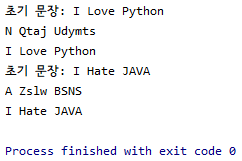

# 📌 Caesar Cipher (카이사르 암호 또는 시저 암호)

`Caesar Cipher`은 치환법. 즉, 평문의 문자들을 다른 문자로 치환해 암호화하는 고대 암호이다.

정확히 각 문자를 알파벳 순서로 세 번째 뒤 문자로 치환하는 암호를 `Caesar Cipher`라고 한다.

이것을 응용해 간단한 `Shift Cipher`를 만들 수 있다.

```python
    def encoding(self) -> str:
        self.msg = list(self.msg)
```

문자열을 한 글자 한 글자 바꾸려면 리스트 타입으로 바꿔줘야 하기 때문에 list 메서드를 이용해 타입 변환을 시켜준다.

```python
        for i in range(len(self.msg)):
            if self.msg[i].isupper():
                self.msg[i] = chr((ord(self.msg[i]) - 65 + self.num) % 26 + 65)
            elif self.msg[i].islower():
                self.msg[i] = chr((ord(self.msg[i]) - 97 + self.num) % 26 + 97)
```

`isupper()` => 해당 문자열이 대문자로 이루어져 있는지에 따라 Bool 값을 리턴한다.

`islower()` => 해당 문자열이 소문자로 이루어져 있는지에 따라 Bool 값을 리턴한다.

만약 X((_X의 아스키코드는 88이다_))를 5만큼 밀어내야할 때 그냥 X의 아스키코드에 5를 더해버리고 출력하면 ] 이 출력되는 불상사가 생긴다.

self.num을 더할 때 Z 혹은 z의 아스키코드를 넘기면 A 혹은 a의 아스키코드부터 다시 더해지는 계산식을 짜야한다.

그 계산식이 위의 `chr((ord(self.msg[i]) - 65 + self.num) % 26 + 65)` 형태이다.

참고로 알파벳은 26개이며 A의 아스키코드는 65, a의 아스키코드는 97이다.

```python
        self.rt_msg = ''.join(self.msg)
```

`join()` => 해당 리스트 값들을 문자열로 바꿔준다.

```python
    def decoding(self) -> str:
        try:
            self.rt_msg = list(self.rt_msg)
        except:
            print('No message encoded.')

        for i in range(len(self.rt_msg)):
            if self.rt_msg[i].isupper():
                self.rt_msg[i] = chr((ord(self.rt_msg[i]) - 65 - self.num) % 26 + 65)
            elif self.rt_msg[i].islower():
                self.rt_msg[i] = chr((ord(self.rt_msg[i]) - 97 - self.num) % 26 + 97)

        self.dec_msg = ''.join(self.rt_msg)

        return self.dec_msg
```

위의 encoding 메서드와 비슷하며 프로그램 내에서 객체를 생성하고 encoding 메서드를 호출하지 않고 바로 decoding 메서드를 호출하면 에러가 난다.

## 📌 결과



